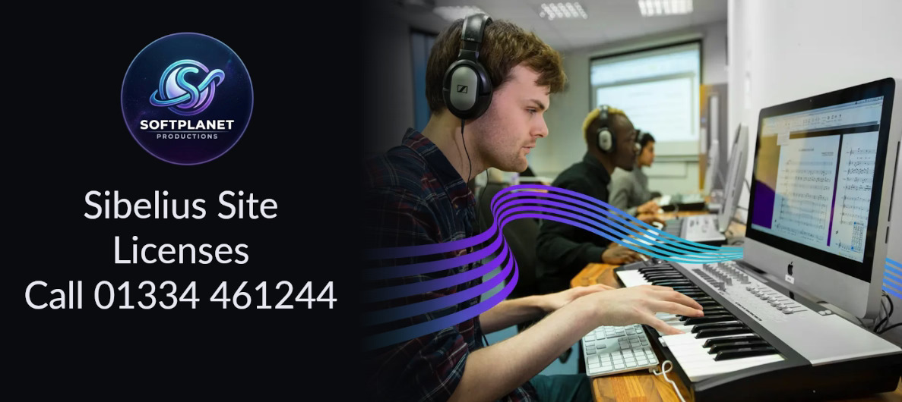

## UK Sibelius Site Licenses & Educational Support

Sibelius is the industry-standard music notation software used in schools, colleges, and universities across the UK — and getting the right licensing in place shouldn't be complicated. Softplanet Productions provides official Sibelius site licenses, multi-seat arrangements, and dedicated educational support, tailored specifically to the needs of UK schools and colleges.

### Why choose a site license?

A site license allows your institution to install Sibelius across multiple computers or an entire department — ideal for music classrooms, computer suites, and practice rooms — without the cost and hassle of managing individual single-user licenses. Whether you're equipping a single classroom or an entire school network, we'll help you find the right licensing tier for your needs and budget.

### What we offer

- **Multi-seat licensing** — scaled to your institution's size, from small departments to whole-school deployments
- **Tailored educational discounts** — pricing designed specifically for UK schools and colleges, recognising education budgets
- **Ongoing support** — straightforward help with setup, renewals, and any licensing questions along the way

### Who this is for

This service is available to **UK-based schools, colleges, and educational institutions**. If you're a music department head, IT coordinator, or school administrator looking to license Sibelius for your students and staff, we're here to help make the process simple.

### Get in touch

Ready to discuss licensing for your school or college? Contact us directly to talk through your requirements and get a tailored quote.

<iframe data-tally-src="https://tally.so/embed/Y5APVJ?alignLeft=1&hideTitle=1&transparentBackground=1&dynamicHeight=1" loading="lazy" width="100%" height="783" frameborder="0" marginheight="0" marginwidth="0" title="Sibelius Licensing Enquiry"></iframe>
